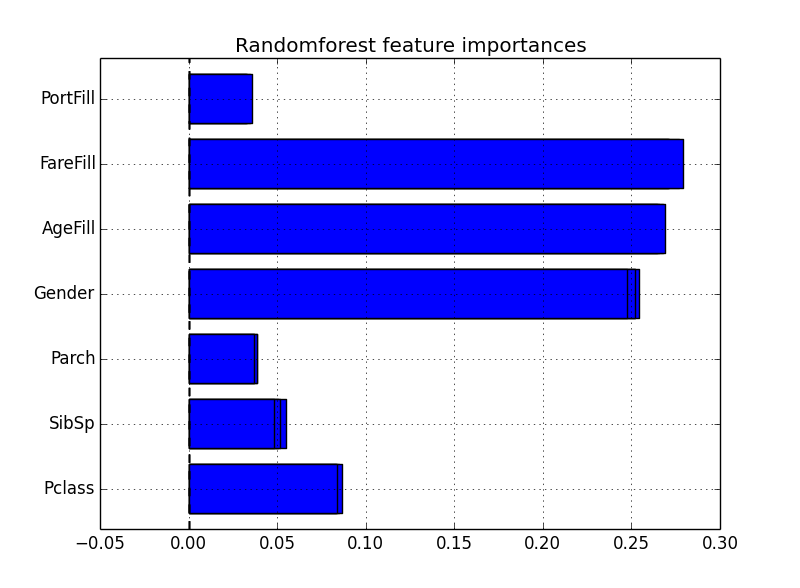

##データクリーニング
- cleaning  

##ランダムフォレストによる予測
MyfirstForest.py
- クレンジング後のデータにランダムフォレストを適用して予測（交叉検定あり）
- 特徴量別の重要度をグラフ化  

##結果
- Rのrandommeforestと比較してgendearの重要度が低すぎる
- トレーニングデータによる交叉検定ではスコアは0.81ほどだが、
テストデータのkaggleでの予測結果0.78ほどと低い

